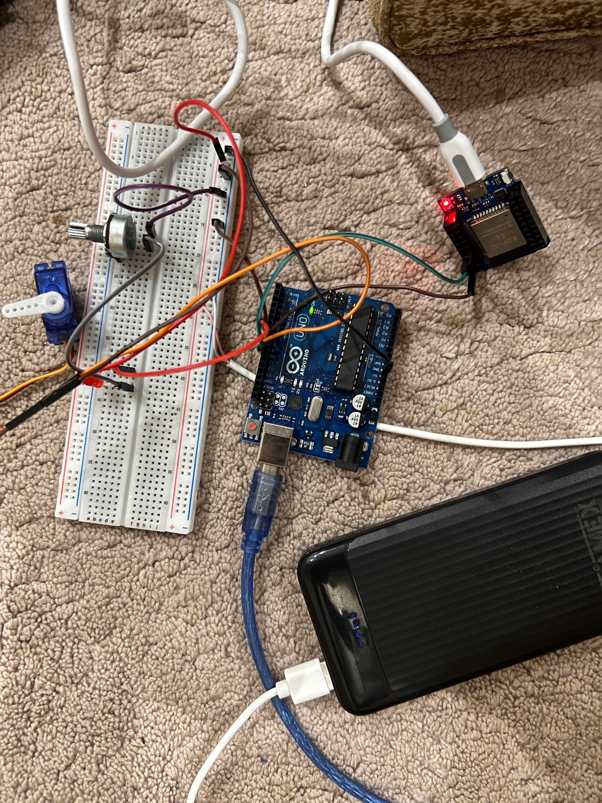

# ESP32 to Arduino Servo Control via UART

## Overview
This project demonstrates communication between an ESP32 and an Arduino Uno using the UART protocol.  
The ESP32 creates a WiFi Access Point and hosts a simple web interface with control buttons.  
When a user presses a button, a command is sent to the Arduino, which then controls a micro servo motor and an LED.



---

## How It Works

### Communication Protocol
The communication between ESP32 and Arduino is done using:

- **UART (Serial Communication)**
- ESP32 sends commands: `F` and `B`
- Arduino receives and executes the commands

### Flow
1. ESP32 creates a WiFi network
2. User connects via phone/laptop
3. User opens web page (192.168.4.1)
4. User presses:
   - **Forward → sends 'F'**
   - **Backward → sends 'B'**
5. Arduino receives command and:
   - Moves servo
   - Controls LED

---

## Components
- ESP32
- Arduino Uno
- Micro Servo Motor
- LED
- Potentiometer (used as resistor)
- Breadboard
- Jumper wires
- External 5V power supply (for servo)

---

## Wiring

### ESP32 → Arduino
- ESP32 **GPIO17 (TX)** → Arduino **Pin 10 (RX via SoftwareSerial)**
- ESP32 **GND** → Arduino **GND**

### Servo
- Red → 5V (external power)
- Brown/Black → GND
- Yellow/Orange → Arduino **Pin 9**

### LED
- Arduino **Pin 7 → LED → Potentiometer → GND**

Make sure all GNDs are connected together.

---

## Code

### ESP32 Code

```cpp
#include <WiFi.h>

const char* ssid = "ESP32_Control";
const char* password = "12345678";

WiFiServer server(80);
HardwareSerial mySerial(2);

void setup() {
  Serial.begin(115200);
  mySerial.begin(9600, SERIAL_8N1, 16, 17);

  WiFi.softAP(ssid, password);
  server.begin();
}

void loop() {
  WiFiClient client = server.available();

  if (client) {
    String request = client.readStringUntil('\r');
    client.flush();

    if (request.indexOf("/F") != -1) {
      mySerial.write('F');
    }

    if (request.indexOf("/B") != -1) {
      mySerial.write('B');
    }

    client.println("HTTP/1.1 200 OK");
    client.println("Content-type:text/html");
    client.println();

    client.println("<html><body>");
    client.println("<h1>ESP32 Control</h1>");
    client.println("<a href=\"/F\"><button>Forward</button></a>");
    client.println("<a href=\"/B\"><button>Backward</button></a>");
    client.println("</body></html>");

    client.stop();
  }
}
```

### Arduino Code
```cpp
#include <Servo.h>
#include <SoftwareSerial.h>

Servo myServo;
SoftwareSerial espSerial(10, 11);

const int servoPin = 9;
const int ledPin = 7;

void setup() {
  Serial.begin(9600);
  espSerial.begin(9600);

  myServo.attach(servoPin);
  myServo.write(90);

  pinMode(ledPin, OUTPUT);
  digitalWrite(ledPin, LOW);
}

void loop() {
  if (espSerial.available()) {
    char c = espSerial.read();

    if (c == 'F') {
      digitalWrite(ledPin, HIGH);
      myServo.write(180);
    } 
    else if (c == 'B') {
      digitalWrite(ledPin, LOW);
      myServo.write(0);
    }
  }
}
